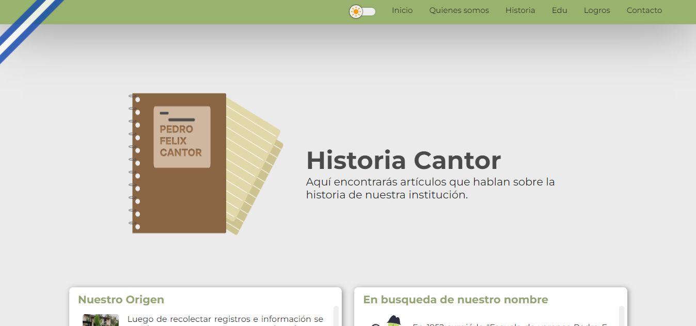

# **PEDRO F CANTOR &middot; WEB** 

Sitio Web oficial del Complejo Educativo "Pedro F. Cantor" 🦁 
Proyecto de desarrollo frontent

[Visitar la página](index)

## DESCRIPCIÓN

---

- ### Objetivos

  - Crear un sitio web amigable, informarivo y educativo.
  - Que sea un sitio web escalable, código facil de leer el codigo.
  - Mejorar la UX (User Experience) a cada usuario, que cualquier persona entienda con facilidad el sitio.

- ### Tecnologias

  - Javascript vanilla
  - CSS (Sass en formato scss)
  - HTML
  - SweetAlert (libreria de alertas)

- ### ¿Comó esta construido?

  - Proyecto pensado para que sea escalable y modificable.
  - Funciona con las tecnologias básicas de la web.
  - Sistemas de carpetas individual para cada pagina dentro del sitio

## CARPETAS

---

- ### /

  la **carpeta raiz** que contiene a las demas como en todo proyecto también contiene el [index.html](index)

- ### scss

  Los estilos son manejados con el preprocesador Sass en esta carpeta estan los estilos generales para todo el sitio y los del [index.html](index)

- ### pages

  Esta contiene las paginas del menu del sitio como: quienes somos, historia, etc. Ademas que dentro de cada una se encuentra esta estructura:

  - js (con los scripts que ejecuta esa pagina)
  - scss (estilos modularizados):
  - archivo.html

- ### img

  Contiene las imagenes base a utilizar en el sitio (no es la unica carpeta de imagenes, en assets/css/back se encuentran imagenes a usar como background)

- ### data

  Esta carpeta contiene archivos Js y Css que funciona como base de datos para actualizar de mejor manera información que contiene el sitio como: _bd_noticias.js, bg_preguntas.js, etc..._

- ### assets
  Esta carpeta contiene utilidaes del proyecto en carpetas como:
  - css: en esta carpeta se transpila Sass
  - js: para el Javascript general
  - svg: imagenes svg de uso general

## Mecánica de la carpeta Data/

---

Data contiene archivos de gestión de la información presentada para que sea mas facil modificarlos. Esta información contenida en archivos .js despues son "inyectados" en el documentos html que le corresponde

- backgrounds: contiene archivo css para manipular las imagenes backgrounds de algunas páginas del sitio

- bg\_\_calendario.js :base de datos para las tarjetas de eventos en el [index](index)

- bd_logros.js: base de datos de los logros de la misma pagina [logros](https://eliseodesign.github.io/cantor/pages/logros/logros.html)

- bd_noticias: base de datos de la sección de publicaciones en el home de [index](index)

- bg_preguntas: del [juego de pregunta](https://eliseodesign.github.io/cantor/pages/edu/juegos/quizzi/preguntas.html)

- cambiar_estilos.css: para cambiar estilos a todo el sitio, contiene la cinta flotante de eventos

## Páginas del sitio

|        Página | Descripción                                                                                                                                  | img                                                        |
| ------------: | -------------------------------------------------------------------------------------------------------------------------------------------- | ---------------------------------------------------------- |
| Quienes somos | En ella se da más información acerca de la institución, valores, misión, visión, etc...                                                      |  |
|      Historia | Contiene la historia de la institución a traves de tarjetas que se pueden abrir o cerrar estas se inyectan en el html a traves de javascript |            |
|           Edu | Esta es una página dedicada al esfuerzo de los alumnos donde se reconoce la excelencia y el trabajo de todos                                 |                      |
|        Logros | Sección para mostrar a traves de una linea de tiempo vertical, la cual inyecta la información en el html desde el archivo bg\_\_logros.js    |                |
|      Contacto | Página para mostrar información de contacto que contiene ademas un iframe de google maps y un formulario de contacto                         |            |

---

Creador por: [Eliseo Francisco Arévalo Espinoza](https://eliseodesign.github.io)

<!-- referencia de enlaces para usar -->

[index]: https://eliseodesign.github.io/cantor/
